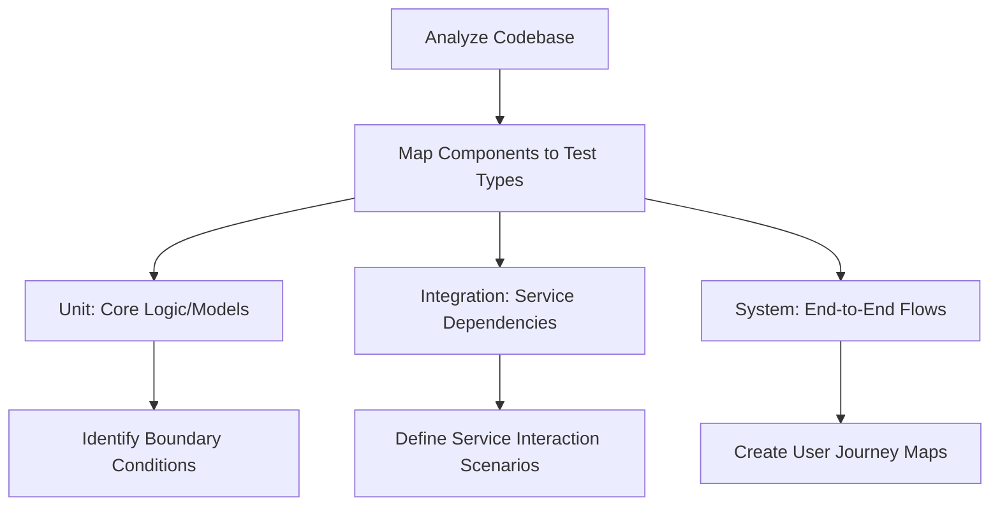
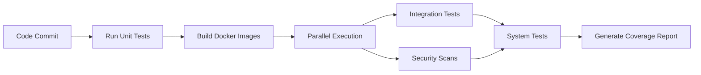

# DeepSearchPersist Test Architecture (SPARC Iteration 2)

## 1. Algorithmic Test Development Approach

### Test Identification Process


### Input Data Strategy
| Data Type          | Source                | Validation Method         |
|--------------------|-----------------------|---------------------------|
| Normal Inputs      | API Schema            | Fuzzing with Hypothesis   |
| Edge Cases         | Code Analysis         | Parameterized Pytest      |
| Malicious Payloads | OWASP Test Suite      | Security Scan Integration |
| Performance Data   | Production Metrics     | Locust Load Testing       |

### Container Validation Workflow
1. Build test-specific Docker images
2. Verify service discovery mechanisms
3. Test environment variable propagation
4. Validate cross-container networking
5. Execute healthcheck endpoint tests
6. Perform clean shutdown/recovery tests

## 2. Test Suite Architecture

### Directory Structure
```
tests/
├── unit/               # Fast execution <1s
│   ├── core/           # Pure logic tests
│   └── models/         # Data structure validation
├── integration/        # Service-boundary tests
│   ├── api/            # FastAPI endpoint tests
│   └── persistence/    # MongoDB/Redis integration
├── system/             # Full-stack tests
│   ├── user_flows/     # Browser-simulated workflows
│   └── chaos/          # Failure scenario testing
└── conftest.py         # Shared fixtures
```

### CI/CD Integration


### Dependency Management
- **Isolation:** Separate `requirements-test.txt` with:
  ```txt
  pytest==8.2.0
  pytest-docker==1.0.0
  pytest-asyncio==0.23.6
  fakeredis==2.21.1
  ```
- **Docker Comppose Overrides:**
  ```yaml
  services:
    tests:
      build: .
      command: pytest tests/ --cov=deep_search_persist
      depends_on:
        redis:
          condition: service_healthy
  ```

## 3. Validation Metrics

| Test Layer     | Coverage Target | Timeout Threshold | Quality Gate          |
|----------------|-----------------|-------------------|-----------------------|
| Unit           | 95%             | 30s               | Zero failing tests    |
| Integration    | 85%             | 2m                | <5% performance delta |
| System         | 70%             | 5m                | 100% scenario pass    |

## 4. Traceability Implementation

```mermaid
graph LR
    A[Requirement ID] --> B[Test Case]
    B --> C[Code Path]
    C --> D[Coverage Report]
    D --> E[CI Pipeline]
    E --> F[Audit Trail]
