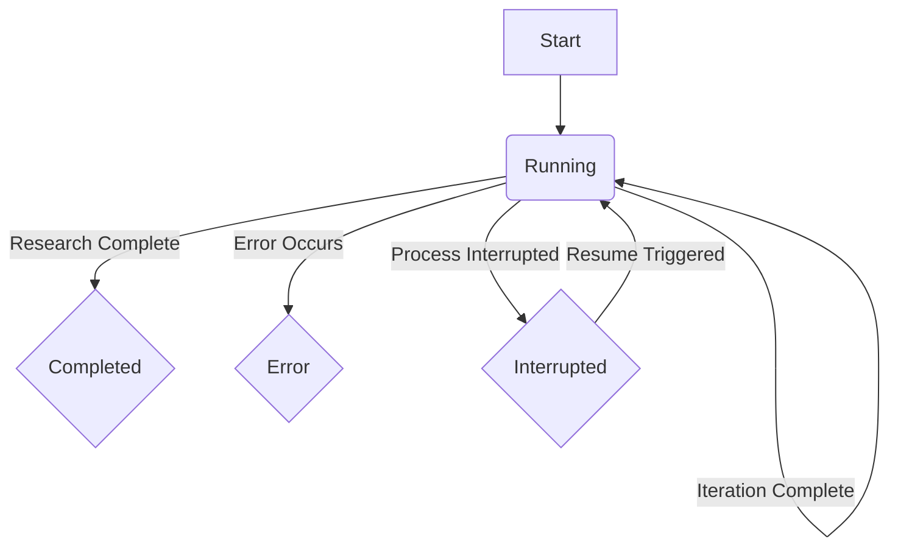
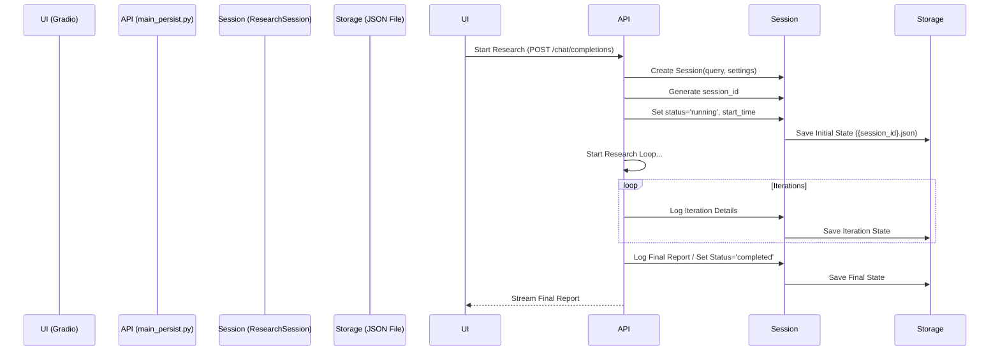
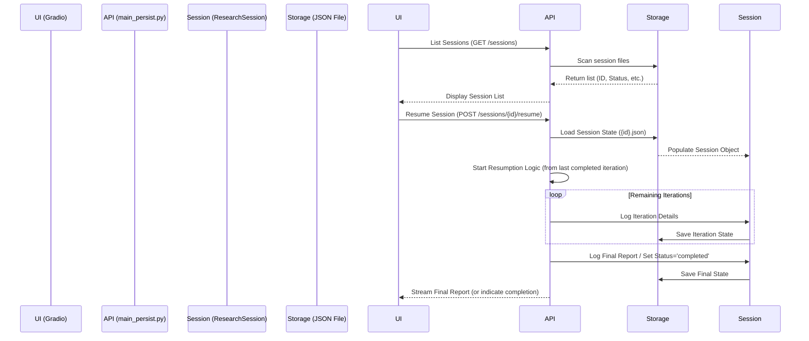

# Plan for Implementing Persistence in OpenDeepResearcher

**Version:** 1.0
**Date:** 2025-03-30

## 1. Goal

Implement persistence for research sessions within the `docker/main_persist.py` script. This will allow users to save the state of their research (initial settings, iterative results, final report) for later review and resumption of interrupted sessions via the Gradio UI (`simple-webui/gradio_online_mode.py`), while maintaining separation from the core `docker/main.py` logic.

## 2. Logging Structure (Data Model)

We will enhance the existing `ResearchSession` class in `docker/main_persist.py`. The data will be stored in a structured format, likely JSON.

**Proposed `ResearchSession` Structure:**

```json
{
  "session_id": "uuid-string-here", // Unique identifier (UUID v4)
  "start_time": "iso-timestamp",    // ISO 8601 format
  "end_time": "iso-timestamp | null", // ISO 8601 format or null if running/interrupted
  "status": "running | completed | interrupted | error", // Current state
  "user_query": "string",           // Initial user query
  "system_instruction": "string | null", // Optional system instruction
  "settings": {                     // Settings used for the session
    "max_iterations": "int",
    "max_search_items": "int",
    "default_model": "string",
    "reason_model": "string",
    "use_ollama": "boolean",
    "use_jina": "boolean",
    "with_planning": "boolean"
    // Add other relevant config values if needed
  },
  "iterations": [                   // List of completed iterations
    {
      "iteration_number": "int",
      "start_time": "iso-timestamp",
      "end_time": "iso-timestamp",
      "plan_generated": "string",     // Plan guiding this iteration
      "search_queries": ["string"], // Search queries executed in this iteration
      "contexts_gathered": [        // Contexts gathered in this iteration
        {
          "url": "string",
          "query": "string",        // The specific search query that led to this context
          "content_summary": "string" // Summary or key snippet of the context
          // Consider adding full context if feasible and necessary for resumption
        }
      ],
      "next_plan": "string | null" // Plan generated at the end of this iteration for the next one
    }
  ],
  "aggregated_data": {              // Data aggregated across iterations for resumption/reporting
    "all_search_queries": ["string"], // All unique search queries used so far
    "aggregated_contexts": ["string"], // Key context summaries aggregated so far
    "last_plan": "string | null",    // The most recent plan generated (for the next iteration)
    "last_completed_iteration": "int" // Index of the last successfully completed iteration
  },
  "final_report": "string | null",    // The final generated report
  "error_message": "string | null"    // Error message if status is 'error'
}
```

**Key Changes/Refinements:**

*   **`session_id`**: Will be generated using `uuid.uuid4()` upon session creation.
*   **`status`**: Added 'interrupted' state. Will be updated throughout the process.
*   **`settings`**: Explicitly log key settings used for reproducibility/review.
*   **`iterations`**: Refined structure to include start/end times per iteration, the plan *for* that iteration, gathered contexts (summarized for brevity, potentially linking to full saved context if needed), and the plan generated *at the end* of the iteration.
*   **`aggregated_data`**: Clarified purpose - holds state needed for resumption and final report generation. `aggregated_contexts` stores summaries.
*   **Timestamps**: Use ISO 8601 format (`datetime.datetime.now().isoformat()`).

## 3. File Format and Storage

*   **Format:** JSON (as handled by the current `save_session` method).
*   **Location:** A dedicated directory. The existing `simple-webui/logs/sessions/` seems appropriate, assuming it's accessible/writable by the Docker container (e.g., via a volume mount). This should be confirmed or made configurable.
*   **Identification:** Each session will be saved in a file named `{session_id}.json`.

## 4. Logging Points in `docker/main_persist.py`

State saving will occur at critical points within the research workflow, primarily managed by modifying the `ResearchSession` instance and calling its `save_session` method.

1.  **Session Initialization (in `stream_research` or `async_main`):**
    *   Create `ResearchSession` instance.
    *   Generate `session_id` (UUID).
    *   Set `start_time`, `status`='running'.
    *   Log `user_query`, `system_instruction`, `settings`.
    *   Perform initial save: `session.save_session(filepath)`.
2.  **Initial Plan Generation (in `stream_research`):**
    *   After `make_initial_searching_plan_async`, store the plan in `session.aggregated_data['last_plan']`.
    *   Save state: `session.save_session(filepath)`.
3.  **Iteration Start (within `stream_research` loop):**
    *   Record iteration `start_time`.
    *   Store the `plan_generated` for the current iteration (from `session.aggregated_data['last_plan']`).
4.  **Context Gathering (within `process_link` or end of iteration):**
    *   Collect context summaries (URL, query, summary) generated during the iteration. Store these temporarily.
5.  **Iteration End (within `stream_research` loop):**
    *   After processing links and generating the next plan (`judge_search_result_and_future_plan_aync`):
        *   Record iteration `end_time`.
        *   Append iteration details (number, times, plan, queries, gathered context summaries, next plan) to `session.iterations`.
        *   Update `session.aggregated_data` (`all_search_queries`, `aggregated_contexts`, `last_plan`, `last_completed_iteration`).
        *   Save state: `session.save_session(filepath)`.
6.  **Final Report Generation (after `generate_final_report_async`):**
    *   Store the report in `session.final_report`.
    *   Save state: `session.save_session(filepath)`.
7.  **Session End (Success):**
    *   Set `session.status` = 'completed'.
    *   Set `session.end_time`.
    *   Save final state: `session.save_session(filepath)`.
8.  **Session End (Error):**
    *   Implement `try...except` blocks around major processing steps (e.g., the main loop in `stream_research`).
    *   In the `except` block:
        *   Set `session.status` = 'error'.
        *   Set `session.end_time`.
        *   Log the exception message to `session.error_message`.
        *   Save final state: `session.save_session(filepath)`.
9.  **Session End (Interrupted):**
    *   If the process terminates unexpectedly (e.g., container stopped), the last saved state will have `status` = 'running'. We will treat 'running' status on load as potentially interrupted. A dedicated 'interrupted' status could be set via a signal handler or a UI "Stop" button if implemented later.

## 5. Resumption Logic

1.  **Identify Resumable Sessions:** The UI or a new API endpoint will scan the `sessions` directory for JSON files where `status` is 'running' (or 'interrupted' if implemented).
2.  **Load Session:** When resumption is triggered for a specific `session_id`, load the corresponding `{session_id}.json` file using `session.load_session(filepath)`.
3.  **Restart Process:** Invoke a modified version of `stream_research` (or a dedicated resumption function).
4.  **Restore State:**
    *   Use the loaded `session` object.
    *   Set `current_iteration = session.aggregated_data['last_completed_iteration'] + 1`.
    *   Use `session.aggregated_data['last_plan']` as the plan for the `current_iteration`.
    *   Prime any necessary in-memory state (like `all_contexts`, `previous_search_queries`) from `session.aggregated_data`.
5.  **Continue Loop:** Start the research loop from `current_iteration`, skipping prior iterations.
6.  **Saving:** Continue saving state at the end of each subsequent iteration as normal.

## 6. UI Integration Points (`simple-webui/gradio_online_mode.py`)

Modifications needed in `create_ui()` and potentially new API endpoints in `docker/main_persist.py`.

1.  **Session Management Tab/Area:** Add a new section or tab to the Gradio interface.
2.  **List Sessions:**
    *   Component: `gr.Dropdown` or `gr.DataFrame` to display sessions.
    *   Data: Fetch session list (ID, Query, Status, Start Time) from a new API endpoint (e.g., `GET /v1/sessions`).
    *   Functionality: Refresh button.
3.  **View Session Details:**
    *   Component: Button next to each session in the list.
    *   Action: On click, fetch detailed session data (from `GET /v1/sessions/{session_id}`) and display it (e.g., in `gr.JSON` or formatted `gr.Textbox` components). Show settings, iterations, final report/error.
4.  **Resume Session:**
    *   Component: Button next to sessions with 'running'/'interrupted' status.
    *   Action: On click, call a new API endpoint (e.g., `POST /v1/sessions/{session_id}/resume`). The backend triggers the resumption logic. The UI should ideally update to show the ongoing progress similar to a new research task.
5.  **Delete Session:**
    *   Component: Optional button next to each session.
    *   Action: Call a new API endpoint (e.g., `DELETE /v1/sessions/{session_id}`) to remove the session file.
6.  **New Research:** The existing "Start Research" button initiates a new session as before, but now includes the session creation and initial save steps.

## 7. Separation of Concerns

*   **Persistence Logic:** Confined entirely to `docker/main_persist.py` (specifically the `ResearchSession` class and modifications to `stream_research`/`async_main`).
*   **Core Logic:** `docker/main.py` remains unchanged and unaware of persistence.
*   **UI Interaction:** `simple-webui/gradio_online_mode.py` interacts with the persistence features *only* through the FastAPI endpoints defined in `docker/main_persist.py`. No direct file access or persistence logic resides in the UI code.

## 8. Diagrams

**Session State Diagram:**



**Basic Interaction Flow (New Session):**



**Basic Interaction Flow (Resume Session):**



## 9. Next Steps

1.  Review and approve this plan.
2.  Implement the changes in `docker/main_persist.py` (modify `ResearchSession`, add saving logic, create new API endpoints).
3.  Implement the UI changes in `simple-webui/gradio_online_mode.py`.
4.  Test thoroughly (new sessions, error handling, interruption, resumption).
